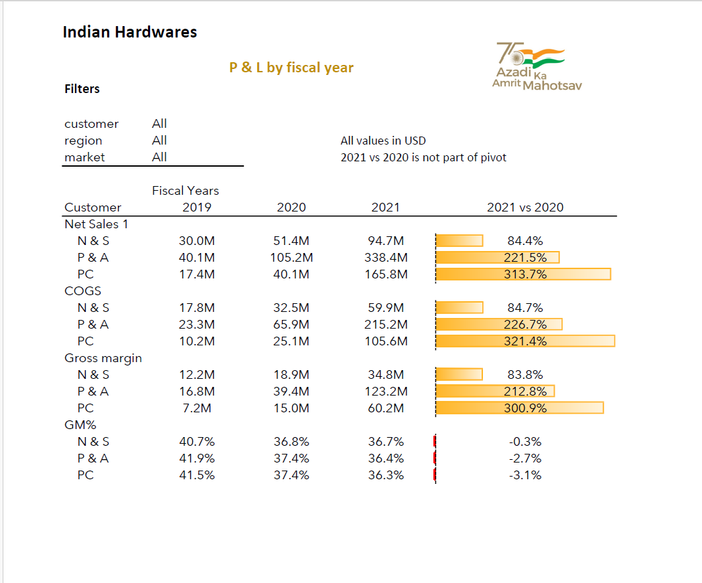

# Finance_Analytics
This Excel project demonstrates Finance Analytics by calculating Profit and Loss based on Net Sales, COGS and Gross Margin. 

Power Pivot and DAX formulas are used to calculate result year wise and month wise in each sheet

1. Sales Report P & L by fiscal year

